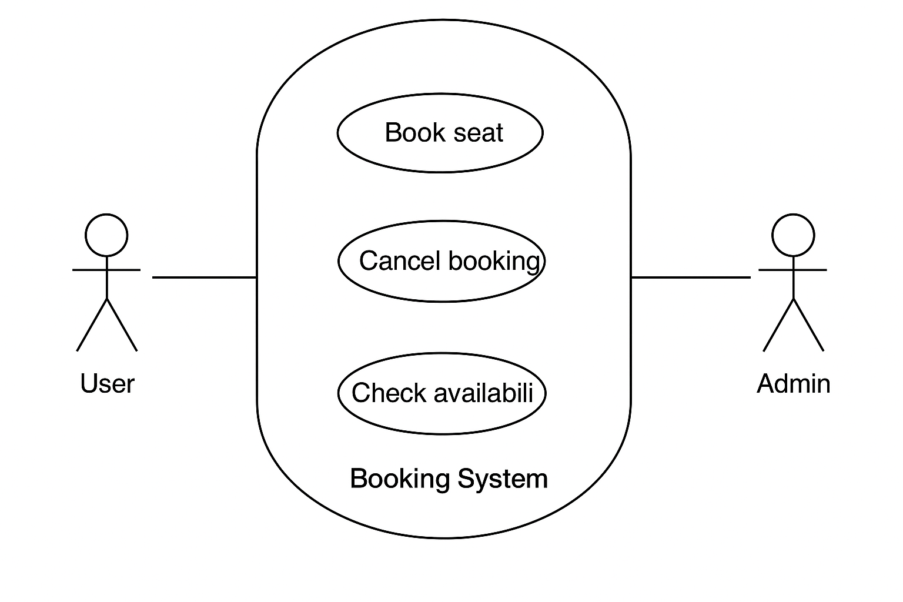

# Requirement Analysis in Software Development

This repo is about learning how software projects collect and write down requirements before building.

\## What is Requirement Analysis?

Requirement Analysis is the process of identifying, gathering, and documenting what a software system should do. It is the first and one of the most important steps in the Software Development Life Cycle (SDLC).

During this phase, developers and stakeholders (such as clients, users, and project managers) work together to clearly define the needs of the system. These needs are written down as "requirements," which act as a guide for the design, development, and testing of the software.

&nbsp;Why is Requirement Analysis Important?

\- \*\*Clarity\*\*: It ensures everyone (developers and clients) understands what the software is supposed to achieve.

\- \*\*Prevents mistakes\*\*: Catching problems early is easier and cheaper than fixing them later.

\- \*\*Saves time and cost\*\*: A well-defined plan avoids unnecessary rework.

\- \*\*Improves quality\*\*: Clear requirements lead to building the right software that meets user needs.

In short, requirement analysis is like creating a blueprint before building a house — without it, the project may fail or not satisfy the users.

Key Activities in Requirement Analysis

Requirement Analysis is not just one step — it involves several important activities to make sure the software meets the needs of users and stakeholders. The key activities are:

\- \*\*Requirement Gathering\*\*: Collecting information from stakeholders (like clients, users, and managers) to understand what they want the system to do.  

\- \*\*Requirement Elicitation\*\*: Using techniques such as interviews, surveys, observations, and brainstorming sessions to dig deeper into the needs of users.  

\- \*\*Requirement Documentation\*\*: Writing down all the requirements clearly in documents (like Software Requirement Specifications - SRS) so everyone has a shared understanding.  

\- \*\*Requirement Analysis and Modeling\*\*: Studying the requirements to check for conflicts, feasibility, and completeness. Sometimes, diagrams or models are created to visualize how the system should work.  

\- \*\*Requirement Validation\*\*: Reviewing the requirements with stakeholders to confirm they are correct, complete, and actually solve the business problem.  

Key Activities in Requirement Analysis

Requirement Analysis is not just one step — it involves several important activities to make sure the software meets the needs of users and stakeholders. The key activities are:

- **Requirement Gathering**: Collecting information from stakeholders (like clients, users, and managers) to understand what they want the system to do.
- **Requirement Elicitation**: Using techniques such as interviews, surveys, observations, and brainstorming sessions to dig deeper into the needs of users.
- **Requirement Documentation**: Writing down all the requirements clearly in documents (like Software Requirement Specifications - SRS) so everyone has a shared understanding.
- **Requirement Analysis and Modeling**: Studying the requirements to check for conflicts, feasibility, and completeness. Sometimes, diagrams or models are created to visualize how the system should work.
- **Requirement Validation**: Reviewing the requirements with stakeholders to confirm they are correct, complete, and actually solve the business problem.

## Types of Requirements

Functional Requirements

Functional requirements describe **what the system should do**. These are the specific features and functions that allow users and administrators to achieve their goals in the booking management project.

Examples:
- The system should allow users to create a new booking.
- Users should be able to cancel or modify an existing booking.
- The system should send confirmation emails after a successful booking.
- Administrators should be able to view all bookings and generate reports.

Non-functional Requirements

Non-functional requirements describe **how the system should perform**. These are quality attributes such as speed, reliability, and security that make the system effective for end users.

Examples:
- The system should load booking results within 2 seconds.
- The system should handle up to 10,000 simultaneous users.
- All booking data must be encrypted for security.
- The system should provide 99.9% uptime availability.

## Use Case Diagrams

A **Use Case Diagram** is a visual representation of the interactions between different users (called *actors*) and the system.  
It helps in understanding the **functional requirements** by showing *who can do what* within the system.

### Benefits of Use Case Diagrams
- Provide a clear and simple way to capture system functionality.
- Help communicate requirements between stakeholders and developers.
- Show relationships between users and different system features.
- Form the foundation for creating detailed functional requirements.

### Booking Management System Use Case Diagram

The diagram below illustrates the main actors and use cases for our booking management project:

## Use Case Diagrams

A use case diagram illustrates the actors (people or systems) and their capabilities within the booking system.

